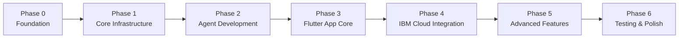

# Orbiter Implementation Plan — Phased Development Strategy

## Executive Summary

This document breaks down the Orbiter mobile VPS admin system into **7 distinct phases** spanning approximately **12-16 weeks** of development. Each phase builds upon the previous one, ensuring we always have a working, demo-able product while progressively adding complexity.

**Key Principle:** Each phase ends with a functional milestone that can be demonstrated independently.

---

## Phase Overview



| Phase | Duration | Milestone | Dependencies |
|-------|----------|-----------|--------------|
| **Phase 0** | 1 week | Development environment ready | None |
| **Phase 1** | 2 weeks | Basic SSH connection working | Phase 0 |
| **Phase 2** | 2-3 weeks | Agent running on server | Phase 1 |
| **Phase 3** | 3 weeks | Flutter app with live metrics | Phase 2 |
| **Phase 4** | 2 weeks | IBM Cloud services integrated | Phase 3 |
| **Phase 5** | 3-4 weeks | AI features & MigrationPilot | Phase 4 |
| **Phase 6** | 2 weeks | Production-ready polish | Phase 5 |

**Total Timeline:** 15-17 weeks (3.5-4 months)

---

## Phase 0: Foundation & Setup (Week 1)

**Goal:** Establish development environment, tooling, and project structure.

### 0.1 Development Environment Setup

- [ ] Install Flutter SDK (stable channel, latest version)
- [ ] Install Go (1.21+) for agent development
- [ ] Install IBM Cloud CLI and plugins
- [ ] Set up Android Studio / Xcode for mobile development
- [ ] Configure VS Code with Flutter and Go extensions
- [ ] Install Git and configure version control

**Deliverable:** All team members can run `flutter doctor` and `go version` successfully.

### 0.2 IBM Cloud Account & Services Provisioning

- [ ] Create IBM Cloud account (free tier)
- [ ] Provision IBM watsonx.ai instance (us-south region)
- [ ] Generate IAM API key with watsonx.ai access
- [ ] Test watsonx.ai API connection
- [ ] Create IBM Cloud Object Storage instance
- [ ] Create bucket: `orbiter-agent-binaries` (public read access)
- [ ] Set up Firebase project for FCM push notifications
- [ ] Generate Firebase Admin SDK credentials

**Deliverable:** All IBM Cloud services accessible via API, credentials stored securely.

### 0.3 Project Structure Initialization

**Flutter Project Structure:**
```
orbiter/
├── lib/
│   ├── main.dart
│   ├── core/
│   │   ├── ssh/
│   │   ├── agent/
│   │   ├── websocket/
│   │   ├── storage/
│   │   └── ibm/
│   ├── features/
│   │   ├── servers/
│   │   ├── dashboard/
│   │   ├── terminal/
│   │   ├── services/
│   │   ├── logs/
│   │   ├── alerts/
│   │   ├── cron/
│   │   ├── migration/
│   │   └── ai/
│   └── shared/
│       ├── widgets/
│       └── theme/
├── test/
└── pubspec.yaml
```

**Go Agent Structure:**
```
agent/
├── main.go
├── api/
│   ├── metrics.go
│   ├── logs.go
│   ├── services.go
│   ├── exec.go
│   ├── files.go
│   ├── processes.go
│   ├── cron.go
│   └── alerts.go
├── websocket/
│   └── hub.go
├── build.sh
└── go.mod
```

- [ ] Create Git repository with proper `.gitignore`
- [ ] Initialize Flutter project
- [ ] Initialize Go module for agent
- [ ] Create directory structures
- [ ] Set up CI/CD pipeline skeleton

**Deliverable:** Clean project structure, compiles without errors.

### 0.4 Dependencies & Package Management

**Flutter Dependencies:**
- `dartssh2` - SSH client
- `xterm` - Terminal emulator
- `fl_chart` - Charts
- `flutter_secure_storage` - Encrypted storage
- `riverpod` - State management
- `dio` - HTTP client
- `web_socket_channel` - WebSocket
- `firebase_messaging` - Push notifications
- `file_picker` - File picker

**Go Dependencies:**
- `github.com/gorilla/websocket`
- `github.com/shirou/gopsutil/v3`
- `github.com/docker/docker`
- `github.com/coreos/go-systemd/v22`

- [ ] Add all dependencies to respective files
- [ ] Run `flutter pub get` and `go mod tidy`
- [ ] Resolve any version conflicts

**Deliverable:** All dependencies installed successfully.

### 0.5 Design System & Theme Setup

- [ ] Create color palette (Green, Amber, Red, IBM Blue)
- [ ] Implement dark and light themes
- [ ] Create reusable widget library
- [ ] Set up typography system
- [ ] Implement IBM Carbon Design influence

**Deliverable:** Theme system working, sample screens render in both modes.

### 0.6 Testing Infrastructure

- [ ] Set up unit test framework
- [ ] Set up integration test framework
- [ ] Configure test coverage reporting
- [ ] Create mock SSH server for testing
- [ ] Set up CI pipeline to run tests
- [ ] Document testing standards

**Deliverable:** Sample tests pass, CI pipeline runs successfully.

**Phase 0 Complete:** Development environment ready, all tools installed, project structure established.

---

## Phase 1: Core Infrastructure (Weeks 2-3)

**Goal:** Establish SSH connectivity and basic server management foundation.

### 1.1 SSH Connection Layer

- [ ] Implement SSH connection manager using `dartssh2`
- [ ] Support password authentication
- [ ] Support private key authentication (RSA, Ed25519)
- [ ] Implement key import from file picker
- [ ] Add connection state management
- [ ] Implement auto-reconnect with exponential backoff
- [ ] Implement SSH port forwarding

**Deliverable:** Can establish SSH connection, execute commands.

### 1.2 Secure Storage Implementation

- [ ] Implement encrypted storage for SSH credentials
- [ ] Create server configuration persistence layer
- [ ] Implement CRUD operations for server list
- [ ] Add encryption for private keys at rest

**Deliverable:** Server credentials stored securely, persist across restarts.

### 1.3 Server List UI

- [ ] Create server list screen with cards
- [ ] Implement "Add Server" form with validation
- [ ] Add connection status indicators
- [ ] Implement server quick-switch sidebar
- [ ] Add server edit/delete functionality

**Deliverable:** Can add, edit, delete servers. UI shows connection status.

### 1.4 Basic Terminal Emulator

- [ ] Integrate `xterm` Flutter package
- [ ] Connect terminal to SSH session
- [ ] Implement keyboard shortcut bar
- [ ] Add pinch-to-zoom for font size
- [ ] Implement copy/paste with long-press
- [ ] Support dark and light terminal themes

**Deliverable:** Functional terminal that can execute commands.

### 1.5 Connection Flow Implementation

- [ ] Implement connection sequence
- [ ] Add connection progress indicators
- [ ] Implement error handling and user feedback
- [ ] Add connection logs for debugging

**Deliverable:** Smooth connection experience with clear feedback.

**Phase 1 Complete:** Can add servers, connect via SSH, execute terminal commands.

---

## Phase 2: Agent Development (Weeks 4-6)

**Goal:** Build the Go agent that runs on the server and exposes metrics/control APIs.

### 2.1 Agent Core & HTTP Server

- [ ] Implement main.go with CLI argument parsing
- [ ] Set up HTTP server listening on localhost:7433
- [ ] Implement token-based authentication middleware
- [ ] Add health check endpoint: `GET /health`
- [ ] Implement graceful shutdown handling
- [ ] Add structured logging

**Deliverable:** Agent binary runs, responds to health checks.

### 2.2 Metrics Collection (WebSocket)

- [ ] Implement CPU usage collector
- [ ] Implement RAM usage collector
- [ ] Implement disk usage collector
- [ ] Implement network usage collector
- [ ] Implement uptime and load average collector
- [ ] Create WebSocket endpoint: `WS /metrics`
- [ ] Stream metrics at 1-second intervals

**Deliverable:** Agent streams real-time metrics via WebSocket.

### 2.3 Service Management API

- [ ] Implement systemd service lister
- [ ] Implement Docker container lister
- [ ] Create unified service list endpoint: `GET /services`
- [ ] Implement service control: start/stop/restart
- [ ] Add service status monitoring
- [ ] Implement service resource usage tracking

**Deliverable:** Can list, start, stop, restart services via REST API.

### 2.4 Log Streaming (WebSocket)

- [ ] Implement log file reader with tail functionality
- [ ] Create WebSocket endpoint: `WS /logs`
- [ ] Support streaming any log file path
- [ ] Implement log filtering by keyword
- [ ] Support systemd journal logs

**Deliverable:** Can stream logs from any file or service in real-time.

### 2.5 Process Management API

- [ ] Implement process lister: `GET /processes`
- [ ] Sort processes by CPU or RAM usage
- [ ] Implement process kill: `POST /processes/{pid}/kill`
- [ ] Add process search by name

**Deliverable:** Can list and kill processes via REST API.

### 2.6 Shell Command Execution (WebSocket)

- [ ] Create WebSocket endpoint: `WS /exec`
- [ ] Execute shell commands and stream output
- [ ] Support interactive commands
- [ ] Implement command timeout
- [ ] Implement dangerous command detection

**Deliverable:** Can execute shell commands and stream output.

### 2.7 File System Operations API

- [ ] Implement file browser: `GET /files`
- [ ] Implement file reader: `GET /files/read`
- [ ] Implement file writer: `POST /files/write`
- [ ] Add permission checks before file operations

**Deliverable:** Can browse, read, write files via REST API.

### 2.8 Cron Management API

- [ ] Implement crontab reader: `GET /cron`
- [ ] Parse cron expressions into human-readable format
- [ ] Implement crontab writer: `POST /cron`
- [ ] Validate cron expressions before writing

**Deliverable:** Can read and write crontab entries via REST API.

### 2.9 Alert Trigger System

- [ ] Implement threshold monitoring (CPU, RAM, disk)
- [ ] Create alert endpoint: `POST /alerts`
- [ ] Send alerts to IBM Cloud Functions endpoint
- [ ] Implement alert cooldown to prevent spam

**Deliverable:** Agent can detect threshold breaches and send alerts.

### 2.10 Agent Build & Distribution

- [ ] Create build script for cross-compilation
- [ ] Build for amd64, arm64, armv7
- [ ] Generate SHA256 checksums
- [ ] Create version.json
- [ ] Upload binaries to IBM Cloud Object Storage

**Deliverable:** Agent binaries available in IBM Cloud Object Storage.

**Phase 2 Complete:** Agent runs on server, all APIs functional, binaries distributed.

---

## Phase 3: Flutter App Foundation (Weeks 7-9)

**Goal:** Build the Flutter app that connects to the agent and displays live data.

### 3.1 Agent Bootstrap Flow

- [ ] Implement agent detection via SSH
- [ ] Implement architecture detection
- [ ] Download agent binary from IBM Cloud Object Storage
- [ ] Implement binary transfer via SFTP
- [ ] Launch agent with session token
- [ ] Implement SSH port forwarding
- [ ] Add health check after agent launch
- [ ] Implement agent auto-update logic

**Deliverable:** Agent automatically installs and launches on first connection.

### 3.2 Live Dashboard UI

- [ ] Create dashboard screen layout
- [ ] Implement metric cards (CPU, RAM, disk, network, uptime)
- [ ] Connect to agent WebSocket
- [ ] Parse and display real-time metrics
- [ ] Implement circular gauges and progress bars
- [ ] Implement sparkline charts for historical data
- [ ] Store metrics history locally (last 24 hours)

**Deliverable:** Dashboard displays live metrics updating every second.

### 3.3 Services Management UI

- [ ] Create services list screen
- [ ] Fetch services from agent
- [ ] Display unified systemd + Docker services
- [ ] Implement color-coded status indicators
- [ ] Add start/stop/restart buttons
- [ ] Implement service search/filter
- [ ] Show CPU and RAM usage per service

**Deliverable:** Can view and control all services from the app.

### 3.4 Log Viewer UI

- [ ] Create log viewer screen
- [ ] Connect to agent WebSocket for logs
- [ ] Display logs with syntax highlighting
- [ ] Implement auto-scroll to bottom
- [ ] Add search/filter functionality
- [ ] Implement log level filtering
- [ ] Support viewing systemd journal logs

**Deliverable:** Can view and search logs from any service or file.

### 3.5 Process Manager UI

- [ ] Create process list screen
- [ ] Fetch processes from agent
- [ ] Display top-style process list
- [ ] Sort by CPU or RAM usage
- [ ] Implement process search
- [ ] Add "Kill Process" with confirmation dialog

**Deliverable:** Can view and kill processes from the app.

### 3.6 State Management & Data Flow

- [ ] Implement Riverpod providers for all features
- [ ] Create state classes for metrics, services, logs, processes
- [ ] Implement WebSocket connection management
- [ ] Add error handling and retry logic
- [ ] Implement offline mode detection

**Deliverable:** Clean state management, reactive UI updates.

### 3.7 Navigation & App Structure

- [ ] Implement bottom navigation bar
- [ ] Create navigation routes
- [ ] Add server switcher in app bar
- [ ] Implement drawer/sidebar for settings
- [ ] Add "Disconnect" button

**Deliverable:** Smooth navigation between all app sections.

**Phase 3 Complete:** Flutter app connects to agent, displays live metrics, controls services.

---

## Phase 4: IBM Cloud Integration (Weeks 10-11)

**Goal:** Integrate IBM watsonx.ai, Cloud Functions, and Object Storage.

### 4.1 IBM watsonx.ai Client Implementation

- [ ] Create watsonx.ai API client class
- [ ] Implement authentication with IAM API key
- [ ] Implement text generation endpoint wrapper
- [ ] Add support for multiple models (Granite, Llama 3)
- [ ] Implement token counting and cost tracking
- [ ] Add error handling and retry logic

**Deliverable:** Can call watsonx.ai API and get responses.

### 4.2 IBM Cloud Functions Setup

- [ ] Create push-relay Cloud Function
- [ ] Deploy function to IBM Cloud
- [ ] Configure Firebase Admin SDK credentials
- [ ] Test function end-to-end
- [ ] Implement function client in Flutter app

**Deliverable:** Alerts trigger push notifications via Cloud Functions.

### 4.3 IBM Cloud Object Storage Integration

- [ ] Implement Object Storage client in Flutter
- [ ] Add binary download logic
- [ ] Implement checksum verification
- [ ] Add version checking
- [ ] Implement caching to avoid redundant downloads

**Deliverable:** Agent binaries download reliably from Object Storage.

### 4.4 Push Notifications Setup

- [ ] Configure Firebase Cloud Messaging in Flutter app
- [ ] Implement FCM token registration
- [ ] Store device token securely
- [ ] Implement notification handling
- [ ] Add notification tap handling (deep link to server)
- [ ] Test notifications on Android and iOS

**Deliverable:** Push notifications work end-to-end.

### 4.5 Alert Configuration UI

- [ ] Create alert settings screen
- [ ] Implement threshold configuration (CPU, RAM, disk)
- [ ] Add per-server alert settings
- [ ] Implement alert history view
- [ ] Add "Silence alerts" functionality

**Deliverable:** Users can configure alert thresholds and view history.

**Phase 4 Complete:** All IBM Cloud services integrated, push notifications working.

---

## Phase 5: Advanced Features (Weeks 12-15)

**Goal:** Implement AI-powered features and MigrationPilot.

### 5.1 Natural Language Terminal

- [ ] Create AI command translator using watsonx.ai
- [ ] Implement command translation UI
- [ ] Add command preview before execution
- [ ] Implement dangerous command detection
- [ ] Add "CONFIRM" dialog for dangerous commands
- [ ] Include server context in AI prompts

**Deliverable:** Natural language commands work reliably.

### 5.2 AI Log Analysis

- [ ] Implement log analyzer using watsonx.ai
- [ ] Add "Analyze" button to log viewer
- [ ] Include metrics context in analysis
- [ ] Display analysis results in readable format
- [ ] Implement proactive analysis on metric spikes
- [ ] Add "Apply Fix" button for suggested solutions

**Deliverable:** AI can analyze logs and provide actionable insights.

### 5.3 "Why is my server slow?" Diagnostic

- [ ] Create diagnostic screen
- [ ] Implement holistic analysis using watsonx.ai
- [ ] Collect full metrics snapshot + recent logs
- [ ] Generate prioritized explanation
- [ ] Suggest specific fixes with commands

**Deliverable:** One-tap server diagnostics with AI-powered insights.

### 5.4 MigrationPilot — Server Scanner

- [ ] Implement server configuration scanner
- [ ] Collect installed packages
- [ ] Collect running services
- [ ] Collect Docker containers
- [ ] Collect web server configs
- [ ] Collect database inventory
- [ ] Collect crontab entries
- [ ] Collect firewall rules
- [ ] Create ServerConfig data model

**Deliverable:** Can scan and collect complete server configuration.

### 5.5 MigrationPilot — AI Plan Generation

- [ ] Implement migration planner using watsonx.ai Llama 3
- [ ] Generate structured migration plan (3 phases)
- [ ] Include exact commands for each step
- [ ] Add estimated times per step
- [ ] Format as interactive checklist
- [ ] Add export to Markdown

**Deliverable:** AI generates comprehensive migration plans.

### 5.6 MigrationPilot — Interactive Execution

- [ ] Create migration plan UI with checkboxes
- [ ] Implement step-by-step execution
- [ ] Add "Run on source" / "Run on target" buttons
- [ ] Connect target server to Orbiter
- [ ] Execute commands on correct server
- [ ] Implement AI validation after each step

**Deliverable:** Complete migration workflow from scan to execution.

### 5.7 Cron Manager UI

- [ ] Create cron manager screen
- [ ] Fetch crontab from agent
- [ ] Display cron entries in human-readable format
- [ ] Implement visual cron expression editor
- [ ] Add/edit/delete cron entries
- [ ] Validate cron expressions

**Deliverable:** User-friendly cron management.

### 5.8 Incident Timeline

- [ ] Implement anomaly detection
- [ ] Correlate metrics, logs, and service states
- [ ] Generate chronological incident timeline
- [ ] Display as readable story
- [ ] Add export to plain text

**Deliverable:** Automatic incident timelines for troubleshooting.

**Phase 5 Complete:** All AI features working, MigrationPilot functional.

---

## Phase 6: Testing & Polish (Weeks 16-17)

**Goal:** Ensure production-ready quality, performance, and user experience.

### 6.1 Comprehensive Testing

- [ ] Write unit tests for all core classes (target: 80% coverage)
- [ ] Write integration tests for critical flows
- [ ] Test on multiple Android devices and versions
- [ ] Test on multiple iOS devices and versions
- [ ] Test with different server configurations
- [ ] Test with different architectures
- [ ] Perform load testing
- [ ] Test offline mode and reconnection
- [ ] Perform security testing

**Deliverable:** Comprehensive test suite with high coverage.

### 6.2 Performance Optimization

- [ ] Profile Flutter app performance
- [ ] Optimize metric streaming
- [ ] Implement efficient data caching
- [ ] Optimize agent memory usage (target: <20MB)
- [ ] Reduce agent binary size (target: <8MB)
- [ ] Optimize dashboard rendering (60 FPS)
- [ ] Optimize battery usage on mobile

**Deliverable:** App meets all performance targets.

### 6.3 UI/UX Polish

- [ ] Implement haptic feedback for all interactions
- [ ] Add loading skeletons (no spinners)
- [ ] Implement smooth animations and transitions
- [ ] Add empty states for all screens
- [ ] Implement error states with retry buttons
- [ ] Add onboarding tutorial
- [ ] Polish all icons and visual elements

**Deliverable:** Polished, professional UI/UX.

### 6.4 Documentation

- [ ] Write user documentation
- [ ] Write developer documentation
- [ ] Document API endpoints
- [ ] Create architecture diagrams
- [ ] Write troubleshooting guide
- [ ] Document IBM Cloud setup process
- [ ] Create demo script (2-minute pitch)

**Deliverable:** Complete documentation for users and developers.

### 6.5 Security Audit

- [ ] Review SSH key storage and encryption
- [ ] Review agent token generation and validation
- [ ] Review API authentication mechanisms
- [ ] Review data transmission security (TLS)
- [ ] Review log sanitization before sending to AI
- [ ] Test for common vulnerabilities
- [ ] Implement rate limiting for API calls

**Deliverable:** Security audit report with all issues resolved.

### 6.6 Demo Preparation

- [ ] Set up demo servers (3 servers with different workloads)
- [ ] Prepare demo script
- [ ] Practice demo multiple times
- [ ] Create backup plan for demo failures
- [ ] Record demo video as backup

**Deliverable:** Polished, rehearsed demo ready for presentation.

**Phase 6 Complete:** Production-ready app, fully tested, documented, and polished.

---

## Critical Path & Dependencies

### Must-Have for MVP (Minimum Viable Product)
1. **Phase 0-1:** SSH connection working
2. **Phase 2:** Agent with metrics and service control
3. **Phase 3:** Flutter app with live dashboard
4. **Phase 4:** IBM Cloud integration (watsonx.ai + alerts)
5. **Phase 5.1-5.2:** Basic AI features (command translation + log analysis)

### Nice-to-Have (Can be deferred)
- MigrationPilot (Phase 5.4-5.6)
- Incident Timeline (Phase 5.8)
- Advanced cron manager (Phase 5.7)

### Parallel Development Opportunities
- **Phase 2 & Phase 3** can partially overlap (agent API development + Flutter UI mockups)
- **Phase 5.1-5.3** (AI features) can be developed in parallel with **Phase 5.4-5.6** (MigrationPilot)

---

## Risk Mitigation

### Technical Risks
1. **SSH connection stability on mobile** → Implement robust reconnection logic early (Phase 1)
2. **Agent installation failures** → Extensive testing on different Linux distros (Phase 2)
3. **watsonx.ai API rate limits** → Implement caching and request batching (Phase 4)
4. **Battery drain from WebSocket connections** → Optimize connection management (Phase 3)

### Timeline Risks
1. **Scope creep** → Stick to MVP features first, defer nice-to-haves
2. **IBM Cloud setup delays** → Complete Phase 0 thoroughly before proceeding
3. **Testing time underestimated** → Allocate full 2 weeks for Phase 6

---

## Success Metrics

### Phase Completion Criteria
Each phase must meet these criteria before moving to the next:
- [ ] All tasks in phase checklist completed
- [ ] Phase milestone demo successful
- [ ] No critical bugs blocking next phase
- [ ] Documentation updated
- [ ] Code reviewed and merged

### Final Success Metrics (Phase 6)
- [ ] Connect to server in <5 seconds
- [ ] Live metrics streaming at 1s refresh
- [ ] AI log analysis in <3 seconds
- [ ] Migration plan generated in <30 seconds
- [ ] Alert delivered in <2 seconds
- [ ] Agent memory footprint <20MB
- [ ] App runs smoothly on 3+ year old devices

---

## Timeline Summary

```
Week 1:    Phase 0 - Foundation & Setup
Week 2-3:  Phase 1 - Core Infrastructure (SSH, Terminal, UI)
Week 4-6:  Phase 2 - Agent Development (Go binary, APIs)
Week 7-9:  Phase 3 - Flutter App Foundation (Dashboard, Services, Logs)
Week 10-11: Phase 4 - IBM Cloud Integration (watsonx.ai, Functions, Storage)
Week 12-15: Phase 5 - Advanced Features (AI, MigrationPilot)
Week 16-17: Phase 6 - Testing & Polish
```

**Total: 17 weeks (4 months)**

---

## Next Steps

1. Review this plan with the team
2. Assign team members to phases
3. Set up project management tool (Jira, Trello, etc.)
4. Begin Phase 0 immediately
5. Schedule weekly progress reviews
6. Adjust timeline based on actual progress

---

**This plan provides a clear roadmap from zero to production-ready Orbiter app in 4 months.**